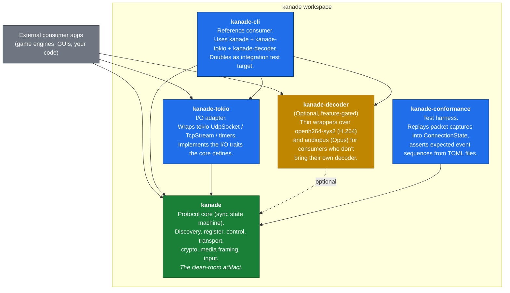
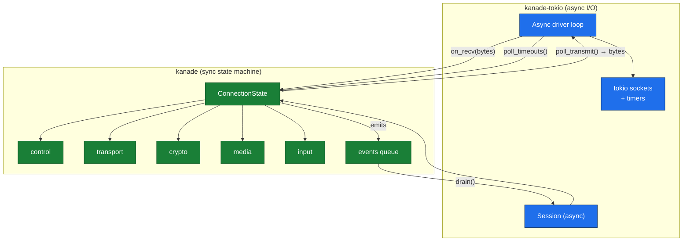
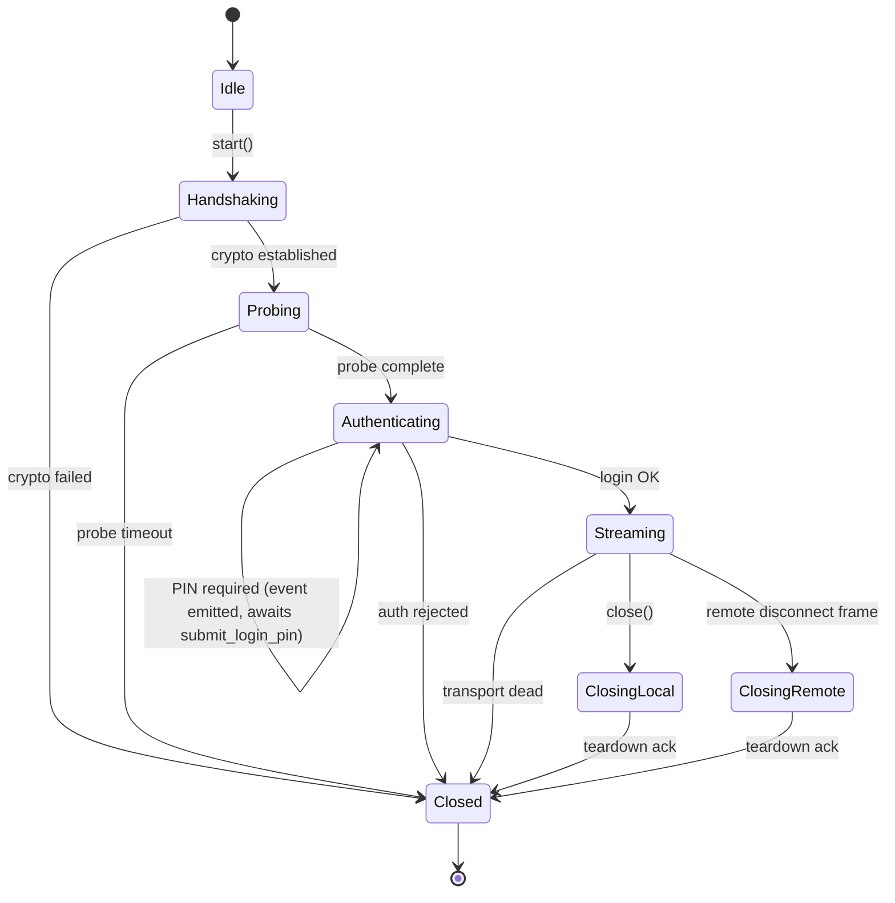
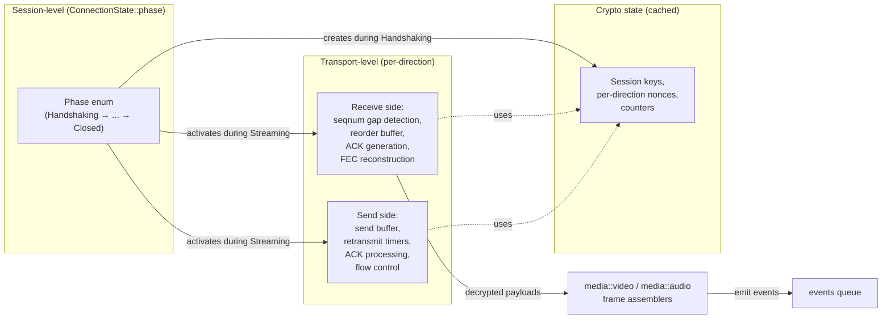
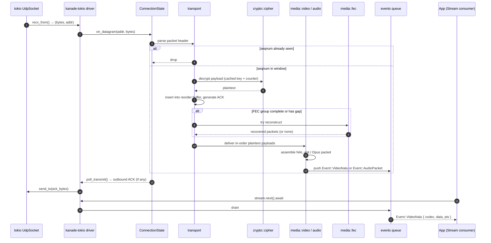
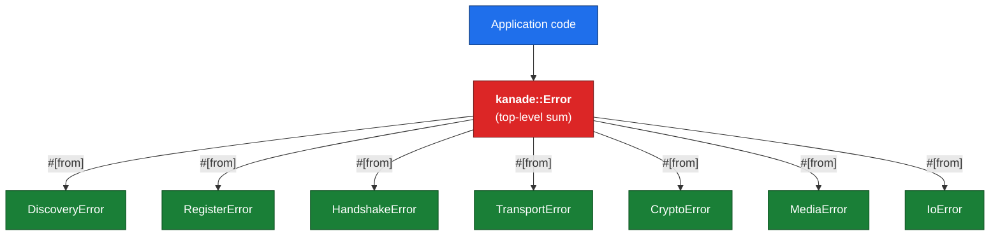
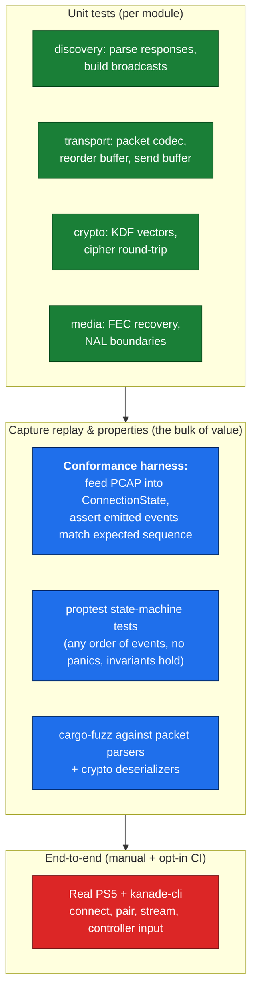
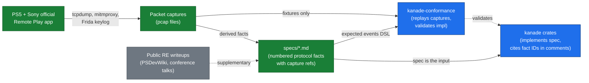
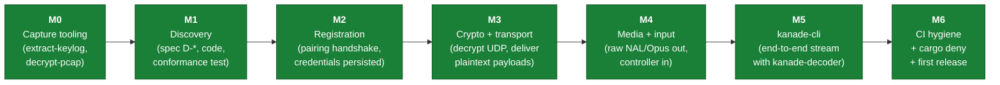

# kanade — Clean-Room Rust Implementation of PlayStation Remote Play

**Status:** Design spec, awaiting review
**Date:** 2026-05-17
**Authors:** brainstormed by Elio Severo Jr. with Claude (Opus 4.7)

> **Important — clean-room boundary notice.** This document was authored in
> a Claude conversation that had prior exposure to `chiaki-ng`'s AGPL
> source code. The design choices below derive from the brainstorming
> process, not from transcription of that source. However, the
> implementation crates under `crates/` must be authored from a context
> with **no** exposure to chiaki/chiaki-ng source. This spec is the
> license-clean handoff between research and implementation. See
> §8 for the full clean-room workflow.

---

## 1. Overview

`kanade` is a clean-room Rust implementation of the PlayStation 4 / PlayStation 5
Remote Play protocol for LAN streaming. It targets feature parity with the LAN
subset of upstream `chiaki-ng` while being:

- **AGPL-free.** Released under MIT OR Apache-2.0 dual license.
- **Memory-safe.** No `unsafe` outside the I/O adapter and codec FFI shims.
- **Composable.** A minimal protocol core that emits raw H.264/H.265 NAL units
  and Opus packets; consumers decode on their own pipeline (CPU, GPU, OS API).
- **Derived from packet captures, not from libchiaki.**

### 1.1 Established parameters

| Decision | Choice |
|----------|--------|
| Motivation | AGPL avoidance via clean-room reimplementation |
| Scope (MVP) | LAN streaming: discovery + pairing + control + transport + crypto + raw audio/video + controller input |
| Out of scope (MVP) | Internet Remote Play, NAT traversal, RUDP over PSN, mic upload, haptics, motion sensor |
| Spec source | Author's own packet captures (primary), public RE writeups (supplementary, cited) |
| Forbidden sources | Source of chiaki/chiaki-ng or any AGPL Remote Play implementation |
| Target license | MIT OR Apache-2.0 dual |
| Library codename | `kanade` |
| Architecture | Minimal protocol core, BYO decoder, tokio-based I/O adapter |
| State machine style | Explicit `enum Phase` (not typestate) on a sync `ConnectionState` |
| Backpressure default | Block driver loop on slow consumer (preserves protocol correctness); opt-in drop policy |
| Conformance test DSL | TOML for declarative expected-event sequences; Rust escape hatch for conditional tests |

### 1.2 Out of scope (deferred to post-MVP)

- Internet Remote Play (PSN signalling, hole-punching, RUDP, NAT traversal)
- Microphone upload (audio direction host → console)
- Haptic feedback to controller
- Motion sensor / gyroscope input
- GUI applications (Qt, egui, ratatui — left to consumers)
- Android / iOS / Switch frontends
- Hardware-accelerated video decoding (left to consumers)

These can be added in later milestones without re-architecting the core.

---

## 2. Workspace & crate architecture



### 2.1 Crate responsibilities

| Crate | Responsibility | Dependencies | License posture |
|-------|----------------|--------------|-----------------|
| `kanade` | Clean-room protocol core. Sync state machine, no async runtime in public types. | RustCrypto (`x25519-dalek`, `aes-gcm`, `sha2`, `hkdf`), `rustls`, `reqwest` (rustls feature), `reed-solomon-erasure`, `bytes`, `thiserror`, `tracing` | MIT OR Apache-2.0; clean-room artifact |
| `kanade-tokio` | Async I/O adapter. Wraps tokio sockets / TLS / timers behind the core's I/O traits. | `tokio`, `tokio-rustls`, `kanade` | MIT OR Apache-2.0; conventional code |
| `kanade-decoder` | Optional codec wrappers. Feature flags: `h264` (openh264-sys2, BSD-2), `opus` (audiopus, Apache-2.0). | `openh264-sys2`, `audiopus`, `kanade` | MIT OR Apache-2.0 |
| `kanade-conformance` | Replays PCAP fixtures into `ConnectionState`, asserts expected events from TOML. | `kanade`, `pcap-parser`, `toml` | MIT OR Apache-2.0; test-only |
| `kanade-cli` | **Headless** reference consumer. Discovery, pairing, streaming smoke tests, stream-to-file, scripted controller input. **No display, no rendering.** A real interactive UI is deliberately out of MVP scope (§1.2). | `kanade`, `kanade-tokio`, `kanade-decoder`, `clap`, `gilrs` (optional, for real-controller input from host) | MIT OR Apache-2.0 |

### 2.2 Why these splits

- The clean-room provenance of `kanade` is the legally-sensitive artifact.
  Keeping it in its own crate isolates the audit trail.
- The sync core + async adapter pattern (`quinn-proto` / `quinn` style)
  keeps the protocol logic deterministic and easy to test, while leaving the
  door open for non-tokio adapters later.
- `kanade-decoder` is opt-in. Consumers with GPU pipelines (Bevy, wgpu) skip
  it; consumers wanting plug-and-play enable both `h264` and `opus` features.
- `kanade-conformance` is a separate crate so the conformance fixtures
  (PCAPs, expected-event TOML) don't bloat the published `kanade` crate.

### 2.3 No `kanade-sys`

There is no C library to wrap. This is from-scratch implementation, not FFI
binding. The `-sys` pattern does not apply.

---

## 3. Module breakdown within `kanade`

```text
crates/kanade/src/
├── lib.rs               # Public re-exports
├── error.rs             # Top-level Error enum + module errors
├── host.rs              # HostInfo, HostCredentials, HostId
├── events.rs            # Events the state machine emits
├── io.rs                # I/O traits (UdpSocket, TcpStream, Timer abstractions)
│
├── discovery.rs         # LAN UDP discovery: broadcast probe, parse responses
├── register.rs          # HTTPS pairing handshake
│
├── connection/          # The streaming state machine (runs after pairing)
│   ├── mod.rs           # ConnectionState — top-level state machine
│   ├── control.rs       # TLS-over-TCP control channel
│   ├── transport/       # Custom UDP reliability layer
│   │   ├── mod.rs
│   │   ├── packet.rs    # Wire format: parse/serialize transport packets
│   │   ├── reliability.rs  # Send buffer, ACKs, retransmit timers
│   │   └── reorder.rs   # Sequence number ordering, gap detection
│   ├── crypto/          # Session crypto
│   │   ├── mod.rs
│   │   ├── handshake.rs # ECDH + session key derivation
│   │   ├── cipher.rs    # Stream cipher for transport payloads
│   │   └── kdf.rs       # Key derivation (HKDF-based)
│   ├── probe.rs         # Pre-stream bandwidth/MTU probing
│   ├── media/           # Frame assembly from transport packets
│   │   ├── mod.rs
│   │   ├── video.rs     # Video frame assembly → raw H.264/H.265 NAL units
│   │   ├── audio.rs     # Audio packet assembly → raw Opus packets
│   │   └── fec.rs       # Reed-Solomon recovery
│   └── input.rs         # Controller feedback packets
│
└── session.rs           # Session — high-level glue over ConnectionState
```

### 3.1 The core pattern: sync state machine + async adapter



This is the same pattern `quinn`/`quinn-proto` uses for QUIC. The benefits:

- The core is deterministic. State transitions are pure functions of
  `(prior state, incoming event)`. No futures inside the protocol.
- The adapter is the only place tokio appears. A second adapter for any
  other runtime is ~300 lines of conventional async code.
- The clean-room boundary is clean: only the core is the legally-sensitive
  artifact.

### 3.2 What each module derives from

| Module | Derived from | Bootstrap notes |
|--------|-------------|-----------------|
| `discovery` | UDP broadcasts on port 9302 (PS5) / 987 (PS4), cleartext capture | Trivial — start here |
| `register` | HTTPS exchange via mitmproxy with own PSN credentials | Need TLS mitm + PSN account |
| `connection::control` | TLS control channel via TLS keylog | Frida or LD_PRELOAD against Sony's app |
| `connection::crypto` | Handshake packets + session-key behaviour | Trickiest module |
| `connection::transport::packet` | UDP wire format after we have session keys | Bootstrapping: needs `crypto` first |
| `connection::probe` | Pre-stream bandwidth probe | May be simplifiable on LAN |
| `connection::media::video` | Decrypted payloads carrying H.264/H.265 NALUs | Mechanical once `transport` + `crypto` work |
| `connection::media::audio` | Decrypted payloads carrying Opus | Same as video |
| `connection::media::fec` | Standard Reed-Solomon over GF(2^8) | Algorithm is public; confirm parameters from captures |
| `connection::input` | Outgoing controller packets captured from official app | Sony's input format |

**Bootstrap order:** discovery → register → crypto handshake → transport →
media + input. Probe slots after crypto, before media.

### 3.3 Public API sketch

```rust
// kanade::lib (re-exports)
pub use discovery::{Discovery, DiscoveredHost};
pub use register::{Registration, RegistrationOutcome};
pub use host::{HostInfo, HostCredentials, HostId};
pub use session::Session;
pub use events::Event;
pub use error::{Error, Result};

// kanade::events
pub enum Event {
    Connected,
    VideoNalu { codec: VideoCodec, data: Bytes, pts: u64 },
    AudioPacket { data: Bytes, pts: u64 },
    LoginPinRequest,
    Disconnected { reason: DisconnectReason },
    // ...
}

// kanade::session
pub struct Session { /* wraps ConnectionState */ }

impl Session {
    pub fn new(host: &HostCredentials, profile: VideoProfile) -> Self;
    pub fn poll_event(&mut self) -> Option<Event>;
    pub fn submit_controller_state(&mut self, state: &ControllerState);
    pub fn submit_login_pin(&mut self, pin: &str);
    pub fn close(&mut self);

    // The driver loop (in kanade-tokio) calls these:
    pub fn on_datagram(&mut self, from: SocketAddr, data: &[u8]);
    pub fn on_control_bytes(&mut self, data: &[u8]);
    pub fn poll_transmit(&mut self) -> Option<Transmit>;
    pub fn poll_timeout(&mut self) -> Option<Instant>;
    pub fn handle_timeout(&mut self, now: Instant);
}
```

In `kanade-tokio`, a thin wrapper turns the `poll_event` loop into a
`Stream<Item = Event>` and runs the driver loop on a tokio task.

---

## 4. State machines & data flow

### 4.1 Session lifecycle



These are real `enum` variants on `ConnectionState::phase`. Every transition
is a method on the state machine returning `Result<(), TransitionError>`;
invalid transitions are impossible to express.

### 4.2 Two-layer state machine



### 4.3 Hot-path data flow (received datagram)



Key invariants:

- Decryption happens before reordering. Per-packet authenticated encryption
  is stateless given keys; bad MACs are dropped early.
- FEC runs after reorder, only when a gap is detected. No speculative work.
- Events are pushed to an internal `VecDeque<Event>`. The adapter drains.
  Lock-free because only the driver thread touches the queue.

### 4.4 Driver loop sketch

```rust
// kanade-tokio (pseudocode)
pub async fn run(mut state: ConnectionState,
                 mut sock: UdpSocket,
                 mut ctrl: TlsStream<TcpStream>,
                 events_tx: mpsc::Sender<Event>) -> Result<(), Error>
{
    let mut buf = vec![0u8; 65536];
    loop {
        let next_timeout = state.poll_timeout();
        tokio::select! {
            recv = sock.recv_from(&mut buf) => {
                let (n, addr) = recv?;
                state.on_datagram(addr, &buf[..n]);
            }
            ctrl_recv = read_control_frame(&mut ctrl) => {
                state.on_control_bytes(&ctrl_recv?);
            }
            _ = sleep_until_opt(next_timeout) => {
                state.handle_timeout(Instant::now());
            }
        }

        while let Some(transmit) = state.poll_transmit() {
            match transmit {
                Transmit::Datagram { to, data } => sock.send_to(&data, to).await?,
                Transmit::Control { data }      => ctrl.write_all(&data).await?,
            };
        }

        while let Some(ev) = state.poll_event() {
            if events_tx.send(ev).await.is_err() { return Ok(()); }
        }
    }
}
```

### 4.5 Backpressure & cancellation

**Backpressure default:** block driver loop if consumer is slow. Preserves
protocol correctness. Opt-in `Session::with_drop_policy()` for consumers
that prefer dropping events under load.

**Cancellation:** `Session::close()` is graceful — transitions to
`ClosingLocal`, sends teardown, waits for ACK (or timeout), then `Closed`.
Dropping `Session` calls `abort()` (Rust `Drop`) for hard termination.

---

## 5. Error handling

### 5.1 Principles

1. **No panics in the protocol path.** Every `unwrap()` is a DoS primitive.
   Use `debug_assert!` only for genuinely-impossible-given-prior-invariants.
2. **Recoverable vs fatal is explicit in the type.** Per-packet decrypt
   failures drop the packet; handshake decrypt failures kill the session.
3. **Source chains preserved** via `thiserror`'s `#[source]`.
4. **Module-local errors compose into top-level `Error`.**

### 5.2 Type layout



### 5.3 Severity helper

```rust
impl Error {
    pub fn is_fatal(&self) -> bool {
        match self {
            Error::Handshake(_) => true,
            Error::Crypto(CryptoError::CounterExhausted) => true,
            Error::Closed(_) => true,
            // Most other errors are per-packet, recoverable.
            _ => false,
        }
    }
}
```

The state machine checks `is_fatal()` for every error: recoverable cases
increment a metric and drop the packet; fatal cases transition `Phase` to
`Closed(Fatal(e))` and emit `Event::Disconnected`.

### 5.4 Result alias

`pub type Result<T> = std::result::Result<T, Error>` re-exported at the
crate root. Module APIs needing tighter types use the long form
`Result<T, DiscoveryError>`.

### 5.5 Logging

Uses `tracing` (not `log`). Default levels:

| Level | For |
|-------|-----|
| `error` | Fatal session-terminating errors with full source chain |
| `warn` | Recoverable errors crossing a threshold |
| `debug` | Per-packet drops, state transitions, retransmits |
| `trace` | Byte-level — reserved for protocol developers |

**No `info`-level inside the protocol** — library code, consumer decides
what's user-visible.

### 5.6 What's deliberately not in errors

- No `MalformedPacket(Vec<u8>)` variant (logging-of-payload footgun).
- No `String` error messages (structured fields only; strings in `Display`).
- No `Generic(String)` escape hatch.

---

## 6. Testing strategy

### 6.1 Pyramid



The middle tier (capture replay + properties) carries most of the
correctness value, because the protocol *is* the captures.

### 6.2 Conformance harness layout

```text
crates/kanade-conformance/
├── Cargo.toml
├── src/
│   ├── lib.rs              # Harness: feeds PCAPs into ConnectionState
│   ├── replay.rs           # PCAP → datagram stream
│   ├── decrypt.rs          # Apply keylog material to decrypt captured TLS
│   └── assertions.rs       # Expected-events DSL (TOML reader)
└── fixtures/
    ├── discovery_ps5.pcap          # Cleartext, safe to commit
    ├── register_ps5_redacted.pcap  # PSN ID redacted, keys removed
    ├── session_ps5.pcap            # Encrypted; keys stored separately
    └── session_ps5.expected.toml   # Expected event sequence (TOML)
```

**Fixture safety rules:**

- Cleartext captures (discovery): commit directly.
- Sensitive captures (registration, session keys): commit the PCAP but
  session keys / PSN credentials live in `fixtures/keys/` (gitignored). Test
  reads from `KANADE_KEYLOG_DIR` env var; skips with clear message if absent.
- **Tests pass without sensitive material.** Cleartext-only tests run on
  every CI build. Tests needing keylog material only run when env var set.

### 6.3 Replay test pattern

```rust
#[test]
fn responds_to_discovery_probe() {
    let mut harness = Harness::new();
    harness.feed_pcap("fixtures/discovery_ps5.pcap");

    harness.expect_event(Event::DiscoveredHost {
        host_type: HostType::Ps5,
        host_name: "PS5-elios".into(),
        // ...
    });
    harness.assert_no_more_events();
}
```

For declarative tests with sequential expected events, expected sequences
live in `*.expected.toml` files. The harness reads them and asserts. Rust
test code is reserved for tests needing conditional logic (PIN entry, error
injection, multi-step interactions).

### 6.4 Property tests for state machines

```rust
proptest! {
    #[test]
    fn transport_never_emits_out_of_order(
        packets in vec(any_packet(), 0..1000)
    ) {
        let mut t = TransportState::new(test_keys());
        let mut last_seq = 0u32;
        for p in packets {
            for delivered in t.on_packet(p) {
                prop_assert!(delivered.seqnum > last_seq);
                last_seq = delivered.seqnum;
            }
        }
    }
}
```

### 6.5 Fuzzing

`fuzz/` directory with `cargo-fuzz` targets for `transport::packet::parse`,
`discovery::parse_response`, `crypto::cipher::decrypt`. Nightly CI job and
on-demand. Goal: zero panics on arbitrary input.

### 6.6 End-to-end smoke

`kanade-cli --smoke` does discovery + pair + 30s stream + clean teardown
against `KANADE_TEST_HOST`. Manual + optional self-hosted CI runner.

### 6.7 Coverage targets

| Layer | Target |
|-------|--------|
| `kanade::discovery` | 100% line + branch |
| `kanade::register` | 100% line + branch (mocked HTTP fixtures) |
| `kanade::connection::transport` | ≥95% |
| `kanade::connection::crypto` | 100% |
| `kanade::connection::media` | ≥90% |
| `kanade-tokio`, `kanade-decoder` | ≥80% |

`cargo-llvm-cov` in CI, hard floor that fails on regression.

---

## 7. Repo layout (post-rename)

```text
kanade/                          # Renamed from rust-chiaki-ng
├── specs/                       # Source of truth for protocol behaviour
│   ├── README.md                # How to read/write specs, citation rules
│   ├── discovery.md
│   ├── registration.md
│   ├── control_channel.md
│   ├── transport.md
│   ├── crypto.md
│   ├── media.md
│   └── controller_input.md
│
├── crates/
│   ├── kanade/
│   ├── kanade-tokio/
│   ├── kanade-decoder/
│   ├── kanade-conformance/
│   └── kanade-cli/
│
├── docs/
│   ├── superpowers/specs/       # Design specs (this file lives here)
│   └── (user-facing docs added later, mdBook)
│
├── tools/                       # Capture-derivation tooling
│   ├── captured/                # Gitignored — local-only
│   ├── extract-keylog/          # Frida script (with mitmproxy fallback)
│   ├── decrypt-pcap/            # Apply keylog to decrypt PCAPs
│   └── README.md
│
├── scripts/
│   ├── audit-citations.sh       # Verify spec ↔ code bidirectional refs
│   ├── check-no-chiaki.sh       # Forbid chiaki/streetpea strings in crates/
│   └── check-fixtures.sh        # Verify fixtures contain no PSN IDs / keys
│
├── .github/workflows/           # CI: lint, test, fuzz nightly, license check
├── CONTRIBUTING.md              # Clean-room rules (see §8.5)
├── README.md
├── LICENSE-MIT
├── LICENSE-APACHE
└── Cargo.toml                   # Workspace manifest
```

---

## 8. Clean-room workflow

The day-to-day discipline that turns "clean-room" from intent into evidence.

### 8.1 The core principle

There is **one source of truth** for protocol behaviour: `specs/`,
derived from the author's own packet captures + enumerated public RE
material. The Rust implementation reads only the spec, never the captures
directly (except for conformance testing). Captures are evidence; the spec
is the spec.



### 8.2 Spec document format

Every spec file follows the same shape. Each fact has:

1. **Stable numbered ID** (`D-1`, `T-12`, `C-7`). Code comments cite these.
2. **Capture reference** (file + packet numbers) so anyone can verify.
3. **Confidence**: HIGH (directly observed), MEDIUM (inferred), LOW (hypothesis).

Example:

```markdown
## D-1. Discovery probe packet (host → console)

The host sends a UDP datagram to the broadcast address on port 9302 (PS5)
or 987 (PS4) with the literal ASCII payload `SRC2` followed by [...].

**Observed in:** `tools/captured/2026-05-17-discovery-ps5.pcap`,
packets 1, 3, 5.

**Confidence:** HIGH (direct observation, cleartext, reproducible).

**Implementation:** `crates/kanade/src/discovery.rs::build_probe`
```

### 8.3 Code citation pattern

```rust
// spec: discovery.md D-1
pub fn build_probe(target: HostType) -> [u8; 20] {
    let mut buf = [0u8; 20];
    buf[..4].copy_from_slice(b"SRC2");
    // ...
    buf
}
```

`scripts/audit-citations.sh` enforces:

- Every spec fact ID exists in ≥1 `// spec:` comment.
- Every `// spec:` comment cites an existing spec fact ID.
- Every spec capture-reference points at an existing file or is marked
  `[FIXTURE]` (sanitized committed fixture).

### 8.4 Working modes

Sessions are exactly one of:

| Mode | Activity | Context allowed |
|------|----------|-----------------|
| **Capture** | Running PS5 + Sony app, capturing pcaps, decrypting | Anything except AGPL source |
| **Spec** | Writing `specs/*.md`, deriving facts from captures + public RE | Captures + public material; no AGPL source |
| **Implement** | Writing Rust under `crates/` | **Only `specs/*.md`** + Rust ecosystem docs. No captures, no AGPL source |
| **Test** | Writing `kanade-conformance` tests | Captures + spec + Rust code |

For LLM-assisted work:

- A fresh LLM conversation starts in one mode and stays in it.
- The implement-mode LLM must not have `tools/captured/` or AGPL source
  in its context.
- A contaminated LLM session (e.g., one that has read chiaki source)
  cannot author code in `crates/`. It can write specs, plans, reviews,
  and tools.

### 8.5 `CONTRIBUTING.md` rules

The boundary, stated concisely:

```markdown
## Clean-room rules

This project must remain a clean-room reimplementation. **Do not, under
any circumstances, read, transcribe, paraphrase, or reference the source
code of `chiaki`, `chiaki-ng`, or any AGPL-licensed Remote Play
implementation when working on `crates/`.**

**Allowed sources for protocol facts** (specs/):

1. Your own packet captures, decrypted with keylog material you obtained
   from your own console + your own copy of the official Sony app.
2. Sony's public-facing API documentation.
3. Public reverse-engineering writeups (PSDevWiki, conference papers,
   academic publications), with citation.
4. Wire-format dissectors in Wireshark (the binary tool, not its source)
   used as inspection-only.

**Forbidden sources:**

- Source code of chiaki, chiaki-ng, moonlight-ps, or any other prior
  client implementation.
- Decompiled / disassembled Sony binaries.
- AGPL-licensed material of any kind.

**Working sessions are either "spec mode" or "implement mode" — not both.**

If you read forbidden material by accident, end your current implement-mode
session, document what was seen, and have a fresh session (or different
person) write the affected code.
```

### 8.6 CI hygiene checks

| Check | What it catches |
|-------|-----------------|
| `scripts/audit-citations.sh` | Spec fact IDs without code references, or vice versa |
| `scripts/check-no-chiaki.sh` | Any string `chiaki`, `streetpea`, etc. in `crates/` |
| `scripts/check-fixtures.sh` | Committed fixtures with unredacted PSN IDs / raw session keys |
| `cargo audit` | Standard dep CVE check |
| `cargo deny check licenses` | Fail if any dep introduces GPL/AGPL transitively |

`cargo deny` is critical — it stops an accidental dep upgrade from
re-introducing GPL contamination via a transitive crate.

### 8.7 Capture tooling (`tools/`)

The unsexy prerequisite that has to exist before specs can be written:

- **`tools/extract-keylog/`**: Frida script attaching to Sony's official
  Remote Play app, dumping TLS session keys to SSLKEYLOG format.
  **Fallback:** mitmproxy + cert-pinning bypass if Frida is blocked.
- **`tools/decrypt-pcap/`**: Takes PCAP + keylog file, produces a
  decrypted PCAP where TLS payloads and derived UDP transport payloads
  are visible.
- **`tools/README.md`**: Step-by-step capture setup per platform.

These are **not for distribution**. They're the author's local capture
workflow. Most users will never touch them.

---

## 9. Risks & open questions

### 9.1 Risks

| Risk | Severity | Mitigation |
|------|----------|------------|
| Frida blocked by Sony's app anti-instrumentation | High | Fallback to mitmproxy + cert pinning bypass; if both fail, project is blocked at the bootstrap step |
| Clean-room defensibility weaker than hoped (LLM training data contamination) | Medium | Document discipline; engage legal counsel before claiming permissive license at release |
| Crypto handshake too complex to derive from captures alone | Medium | Captured handshake includes both sides of ECDH; algebra is recoverable. May require many capture sessions to converge |
| PS5 firmware update changes wire format | Medium | Project re-derives from new captures; consumers expect occasional protocol breakage |
| Solo capacity insufficient for 6–12mo MVP timeline | Medium | Scope is already minimal; further reduction would drop streaming itself |
| Hardware video decode integration in consumers is platform-specific | Low | Out of `kanade`'s scope; `kanade-decoder` provides CPU baseline |

### 9.2 Open questions to resolve during implementation

- **Should `kanade::Session` expose a single high-level future** (`run()` →
  `Result<(), Error>` to completion) **in addition to** the
  `poll_event`-based API? Decide after first integration usage.
- **TLS library**: rustls definitely for the HTTPS registration. For the
  control channel, the captures will reveal whether the console expects
  standard TLS or something modified. If standard, rustls. If modified,
  may need ring directly.
- **Probe simplification**: until captures confirm, treat the probe phase
  as required. After first capture analysis, may collapse to a fixed-value
  stub.
- **Transport reliability tuning** (RTT estimation, retransmit timers):
  derive defaults from captures, then make tunable.

---

## 10. Milestones

Staged so each milestone produces something working:



Each milestone is independently shippable as a crate version and exercises
a slice of the architecture, so design pressure surfaces incrementally
rather than all at the end.

---

## See also

- `specs/README.md` (to be written at M1) — citation conventions, spec
  authoring rules.
- `tools/README.md` (to be written at M0) — capture setup instructions.
- `CONTRIBUTING.md` (to be written at M1) — clean-room rules.
